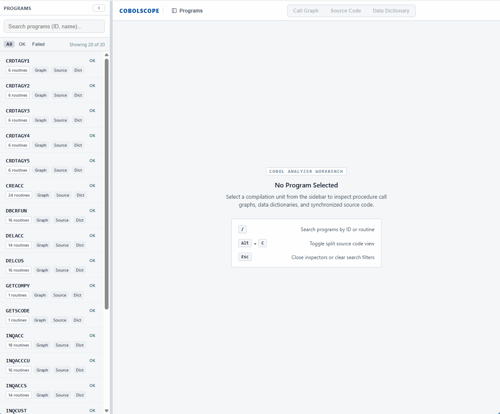
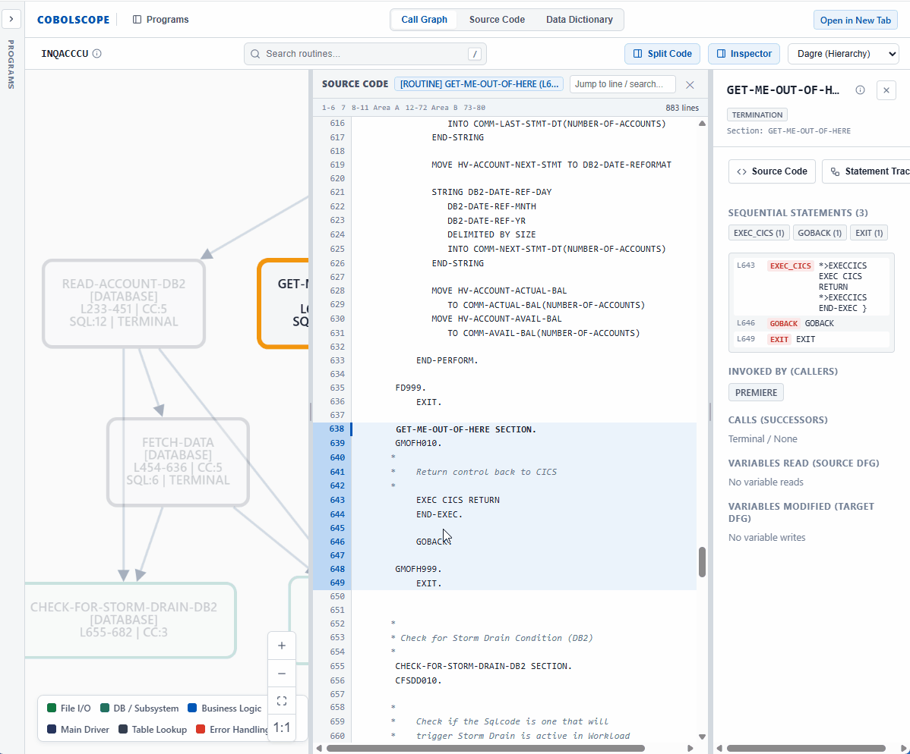
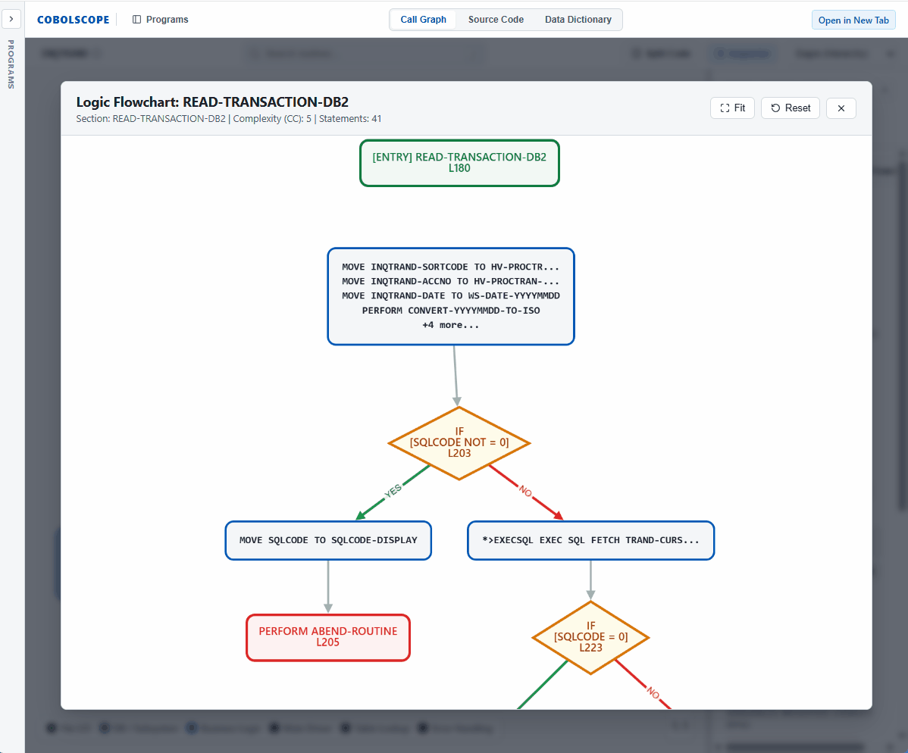
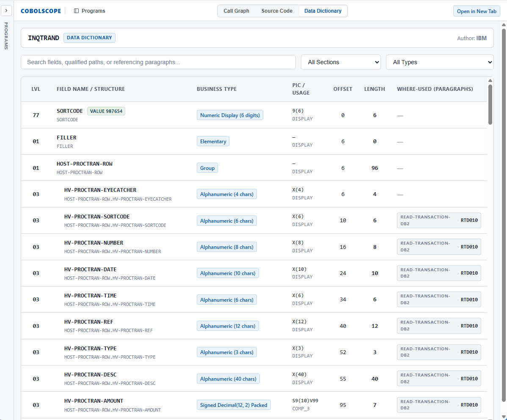
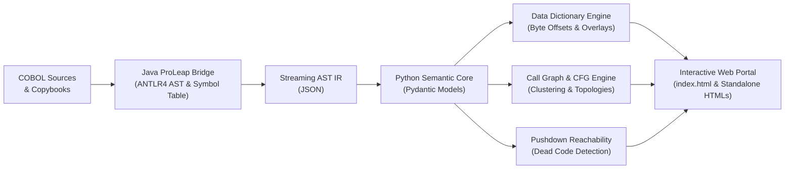

# CobolScope

[](https://goudacouda.github.io/cobolscope/)
[](https://www.python.org/downloads/)
[](https://openjdk.org/)
[](https://gnucobol.sourceforge.io/)
[](https://www.itl.nist.gov/)
[](LICENSE)

**CobolScope** is a tool that turns COBOL programs into interactive call graphs, memory layout data dictionaries, and searchable static HTML documentation.

Built on the [ProLeap ANTLR4 Parser](https://github.com/uwol/proleap-cobol-parser) with a Python semantic engine, it runs completely locally with no database or server requirements.

> **Live Demo**: [https://goudacouda.github.io/cobolscope/](https://goudacouda.github.io/cobolscope/)

---

[](https://goudacouda.github.io/cobolscope/)

---

## What Does It Do?


- **Procedure Call Graphs**: Interactive hierarchy of routines, control flow, and branch targets.
- **Memory Layout Dictionaries**: Exact byte offsets, field sizes, and `REDEFINES` overlays without doing the math by hand.
- **Split Code View (`Alt+C`)**: Jump straight from graph nodes or data dictionary rows to the source line, with identifier occurrence highlighting.
- **Dead Code Detection**: Pushdown reachability analyzer that flags uncalled paragraphs and stranded logic.
- **Static Documentation Portal**: Point it at a directory of COBOL files and copybooks to generate a self-contained `index.html` website you can open directly in any browser.

---

## The Default Way to Use it

CobolScope is designed to be used with with **`--graph` and `--dict`** on a folder of programs or a single file to produce an interactive **HTML portal**:

```bash
# Recommended default: Generate Call Graphs, Data Dictionaries, and the Web Portal
cobolscope path/to/cobol_folder/ -I path/to/copybooks/ --graph --dict -o docs_portal/
```

### What This Generates:
1. **`docs_portal/index.html`**: A standalone documentation portal you can open in any browser (`open docs_portal/index.html` or double-click).
2. **Interactive Call Graphs** for each program with functional clustering, zoom/pan controls, and split code inspection.
3. **Binary Data Dictionaries** with live search, column sorting, type filtering, Where-Used cross-references, and sliding code drawers.
4. **Syntax-Highlighted Source Code**  with highlighting for selected words
5. **`docs_portal/manifest.json`**: Machine-readable metadata and program inventory.

> 💡 **See the output**: Test the fully generated portal deployed on GitHub Pages based on IBM-Bank-Of-Z Open Source Code: **[https://goudacouda.github.io/cobolscope/](https://goudacouda.github.io/cobolscope/)**.

---

## Feature Showcase

### 1. Multi-Program Documentation Portal
Browse all programs in a directory from a sidebar with routine counters, status badges, search filtering, and linkable URLs (e.g. `#program=INQCUST&tab=call_graph`).

[](https://goudacouda.github.io/cobolscope/)

---

### 2. Level-2 Procedure Call Graphs with Wide Split-Screen Code (`Alt+C`)
Understand routine hierarchies. Graph nodes display complexity, statement counts, and directed control transfers. Press **`Alt+C`** or click **View Routine Code** to open the wide-aspect source code viewer centered on the selected procedure.



---

### 3. Level-3 Intra-Procedural CFG Flowcharts
Drill down into complex routines with branching logic (`IF`, `EVALUATE`, `PERFORM UNTIL`). By default it generates fine-grained statement-level flowcharts modeling decision diamonds, execution paths, loop iterations, and terminal exits.



---

### 4. Binary Data Dictionaries with Sliding Code Drawer
Inspect field structures across `WORKING-STORAGE`, `LINKAGE`, and `FILE SECTION` with byte offsets, `REDEFINES` overlays, and Where-Used cross references. Click any variable row to slide open the code drawer with automatic line and variable occurrence highlighting.



---


## Quick Start

### Prerequisites
- **Python 3.10+**
- **Java 17+** runtime (`java` on your `PATH`)

### Installation
The Java parser bridge is pre-compiled and bundled directly with the repository:

```bash
# Clone the repository
git clone https://github.com/GoudaCouda/cobolscope.git
cd cobolscope

# Install the Python package in editable mode
pip install -e .
```

---

## How to Use CobolScope

### 1. Repository-Level Batch Processing (Recommended)

Process an entire directory of COBOL programs in a single run:

```bash
# Full build with interactive call graphs, data dictionaries, and web portal
cobolscope ./src/cobol -I ./src/copybooks --graph --dict -o ./dist/portal/
```

Open `./dist/portal/index.html` directly in your browser. No web server is required.

---

### 2. Single-Program Analysis

Run analysis on individual programs and output specific artifacts:

#### Call Graphs
```bash
# Standalone interactive HTML Call Graph
cobolscope program.cbl -I copy/ --graph -o call_graph.html

# Scalable Vector Graphics (SVG) or Graphviz DOT format
cobolscope program.cbl --graph --graph-format svg -o call_graph.svg
```

#### Data Dictionaries
```bash
# Standalone interactive HTML Data Dictionary. Format md,svg, or html
cobolscope program.cbl -I copy/ --dict --dict-format html -o dictionary.html
```

####  Reachability & Dead Code Detection
```bash
# Find dead paragraphs and uncalled execution paths
cobolscope program.cbl --reachability

# Save verified state transitions to JSON
cobolscope program.cbl --reachability --save-transitions transitions.json
```

####  AST IR Export
```bash
# Stream complete semantic AST JSON to file
cobolscope program.cbl -I copy/ -o program_ast.json
```

---

### 3. Declarative Rules Engine (`cobolscope-rules.yaml`)

Mainframe environments often use proprietary macros or runtime modules (`CEE3ABD`, `ILBOABN0`, `ABEND`) to handle fatal errors. A declarative YAML rules file can be created to model these semantics to ensure nodes are categorized correctly:

```bash
# Automatically scan a codebase and generate a starter rules file
cobolscope --init-rules ./src/cobol -o cobolscope-rules.yaml

# Apply the rules file to any analysis or portal build
cobolscope ./src/cobol --graph --dict -r cobolscope-rules.yaml -o ./dist/portal/
```

---

## Architecture Overview

CobolScope follows a an architecture that pairs a  Java semantic parser with a Python modeling and rendering pipeline:



### Key Architectural Components

- **Java Parser Bridge (`java/`)**: Invokes the ANTLR4 ProLeap parser in a single JVM instance to preprocess copybooks, evaluate `REDEFINES` byte calculations, and extract semantic symbols with JSON serialization.
- **Strongly-Typed Semantic IR (`cobolscope/models/`)**: Formats the raw AST into rich Pydantic models with dedicated representations for structured verbs (`MOVE`, `PERFORM`, `IF`, `EVALUATE`, `CALL`, `EXEC SQL`, `EXEC CICS`) and fallbacks for extended dialects.
- **Memory Layout Engine (`cobolscope/dictionary/`)**: Calculates exact starting byte offsets, group bounds, and memory overlays.
- **Graph & CFG Engine (`cobolscope/graph/`)**: Builds Level-2 procedure call graphs with functional clustering and Level-3 intra-procedural flowcharts using Cytoscape.js.
- **Portal & HTML Generator (`cobolscope/portal/`)**: Assembles static HTML, CSS, and vanilla JS into self-contained, documentation portals with zero external runtime dependencies.

---

## Python API

You can also use CobolScope programmatically as a Python library:

```python
from cobolscope.parser import parse
from cobolscope.models import ProgramModel
from cobolscope.data_dictionary import generate_data_dictionary
from cobolscope.graph import generate_call_graph
from cobolscope.reachability import PushdownReachabilityAnalyzer

# 1. Parse COBOL source with copybook resolution
raw_ir = parse("program.cbl", copybook_dirs=["./copybooks"], format="FIXED")
model = ProgramModel.from_dict(raw_ir)

print(f"Program: {model.program_id} ({len(model.paragraphs)} routines)")

# 2. Generate Interactive Data Dictionary
html_dict = generate_data_dictionary(model, format="html")

# 3. Generate Interactive Call Graph
html_graph = generate_call_graph(model, format="html")

# 4. Run Dead Code / Reachability Analysis
analyzer = PushdownReachabilityAnalyzer(model)
reach_result = analyzer.analyze()
print(f"Reachable: {len(reach_result.reachable_paragraphs)}")
print(f"Dead Code: {reach_result.unreachable_paragraphs}")
```

---

## Keyboard Shortcuts

| Shortcut | Context | Action |
| :--- | :--- | :--- |
| **`Alt + C`** | Call Graph | Toggle split-screen source code viewer |
| **`Esc`** | Any Viewer | Close code drawer, routine inspector, or active modal |
| **Click Row** | Data Dictionary | Slide open split code drawer focused on variable definition |
| **Click Breadcrumb** | Data Dictionary | Jump directly to routine procedure code |
| **`Ctrl + Click` Breadcrumb** | Data Dictionary | Jump straight to routine in Call Graph |
| **Click Any Identifier** | Code Viewers | Highlight all occurrences of that variable across code |

---

## License

This project is licensed under the **Apache License, Version 2.0** - see the [LICENSE](LICENSE) file for details.  
CobolScope utilizes the [ProLeap COBOL Parser](https://github.com/uwol/proleap-cobol-parser) under the MIT License.
